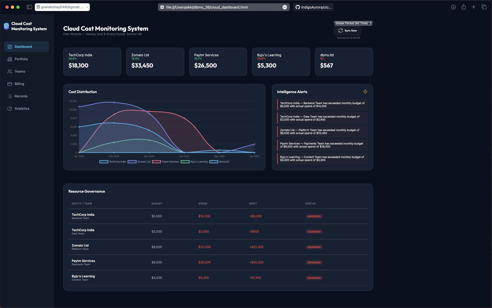
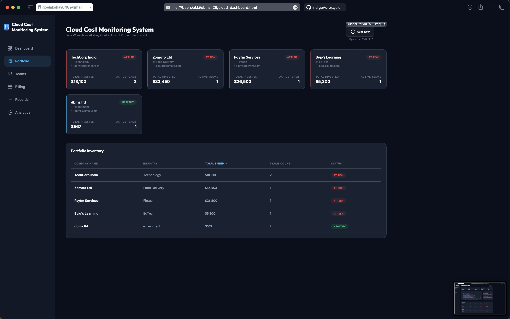
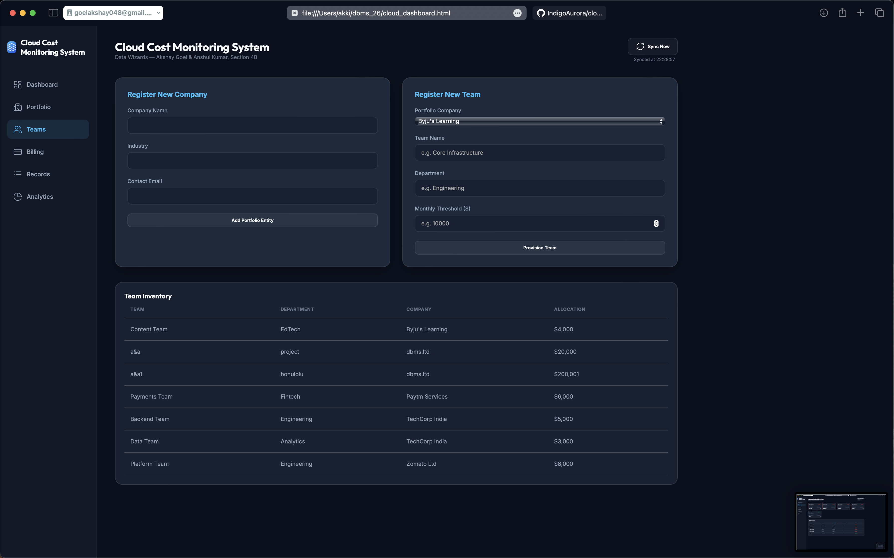
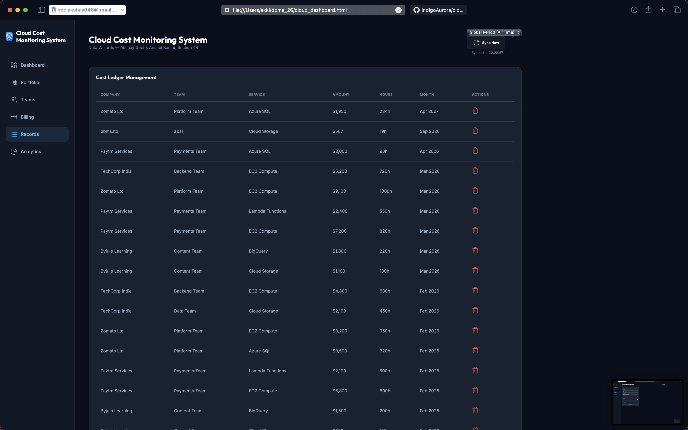
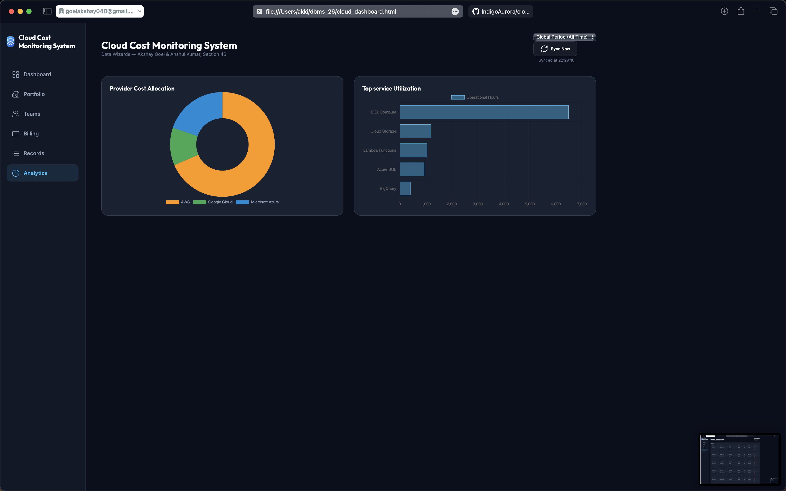

# Cloud Cost Monitoring System
### Data Wizards — Akshay Goel & Anshul Kumar | Section 4B | IILM University

A full stack cloud cost monitoring system built as a DBMS semester project.

## 📸 Project Showcase (App Gallery)

### 1. Main Executive Dashboard
The heart of the system. It features a dynamic **Cost Distribution** graph that renders historical trends leading up to the selected month. The "Intelligence Alerts" section monitors budget breaches in real-time.

### 2. Portfolio Management
A high-level view of all registered companies. This page stays synchronized with the global month filter, showing the "Total Invested" and "Active Teams" for each entity specifically for the selected period.

### 3. Team & Infrastructure Inventory
This section allows for the registration of new portfolio companies and internal teams. It manages the fundamental data structure required for cost attribution.

### 4. Billing & Records Management
The "Log Expense Record" interface handles data entry, while the "Cost Ledger" provides a filtered table of all historical transactions, allowing for granular audit trails.

### 5. Advanced Provider Analytics
A visual breakdown of spending across cloud providers (AWS, GCP, Azure) using interactive doughnut charts and bar graphs to identify top service utilization.

---

## 🚀 Key Features
- **Historical Narrative:** The graph doesn't just show one month; it shows the story leading up to it.
- **Native SQL Performance:** Filtering logic is handled directly in MySQL for maximum speed and data integrity.
- **Multi-Tenant Support:** Manage multiple companies and teams within a single interface.
- **Budget Governance:** Real-time tracking of budget allocations vs. actual spend.

## 🛠 Tech Stack
- **Backend:** Python 3.14 (Flask Framework)
- **Database:** MySQL (Relational Schema)
- **Frontend:** HTML5, CSS3, JavaScript, Chart.js
- **VCS:** Git & GitHub

---

## ⚙️ Setup & Installation
1. **Clone the Repo:** `git clone https://github.com/IndigoAurora/cloud-cost-monitoring-system.git`
2. **Database:** Run the provided `schema.sql` in MySQL Workbench to build the tables and seed data.
3. **Environment:** Create a `.env` file with your database credentials (`DB_HOST`, `DB_USER`, `DB_PASSWORD`).
4. **Run:** Execute `python app.py` and visit `http://127.0.0.1:5001`.

## Features
- Real-time cloud cost monitoring dashboard
- Multi-company and multi-team support
- Automatic budget breach detection and alerts
- Month-wise spending analysis
- Analytics with provider cost breakdown
- Add/delete companies, teams and billing records

## How to Run
1. Start MySQL and ensure cloud_cost_monitoring database exists
2. Install dependencies: pip install flask flask-cors mysql-connector-python
3. Run backend: python app.py
4. Open cloud_dashboard.html in browser

## Pages
- Dashboard - Live spending overview with month filter
- Teams - Manage companies and teams
- Billing - Log monthly expense records
- Records - View and delete all cost records
- Analytics - Provider cost and service utilization charts

## 🚀 Latest Updates (April 19, 2026)
- **Native SQL Filtering:** Migrated month-filtering logic from client-side JavaScript to backend MySQL queries for better performance and data integrity.
- **Dynamic Portfolio Tracking:** Implemented a unified state where the Dashboard, Portfolio, and Analytics all stay synchronized via a single month-dropdown.
- **Historical Trend Intelligence:** The Cost Distribution graph now dynamically renders cumulative history leading up to the selected month.
- **Null-Safe UI:** Added protection for companies with zero monthly spend (like `dbms.ltd`) to prevent UI crashes.
